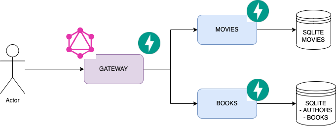

# graphql-poc
Repo with different proofs of concept

## install

1. create venv
2. `pip install -r requirements`
3. run apis

## architecture



## example queries

```graphql
# Welcome to GraphiQL
#
# GraphiQL is an in-browser tool for writing, validating, and
# testing GraphQL queries.
#
# Type queries into this side of the screen, and you will see intelligent
# typeaheads aware of the current GraphQL type schema and live syntax and
# validation errors highlighted within the text.
#
# GraphQL queries typically start with a "{" character. Lines that start
# with a # are ignored.
#
# An example GraphQL query might look like:
#
#     {
#       field(arg: "value") {
#         subField
#       }
#     }


{ getAllBooks {
    id 
    title
    publishingYear
}}

{ getAllMovies {
  movies {
    title
    imdb
    year
  }
}}

{ getAllAuthors {
  id
  firstName
  lastName
  dateOfBirth
}}

{ getAuthorTree(id: "2") {
  name
  dateOfBirth
  books {
    title
    publishingYear
        }
    }
}

{ getCompleteTree(id: "2") {
	author{
    name
    dateOfBirth
    books {
      title
      publishingYear
    }
  }
  movies {
    title
    imdb
    id
    description
  }
}}
```